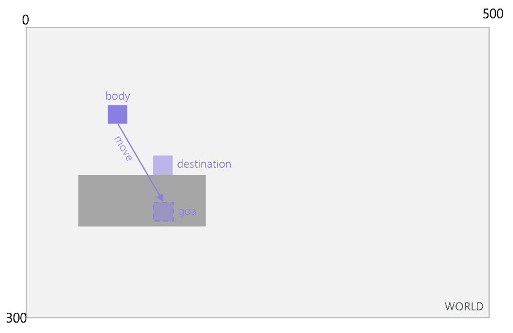
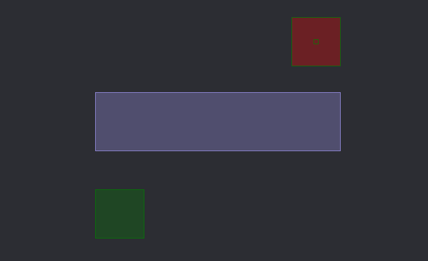
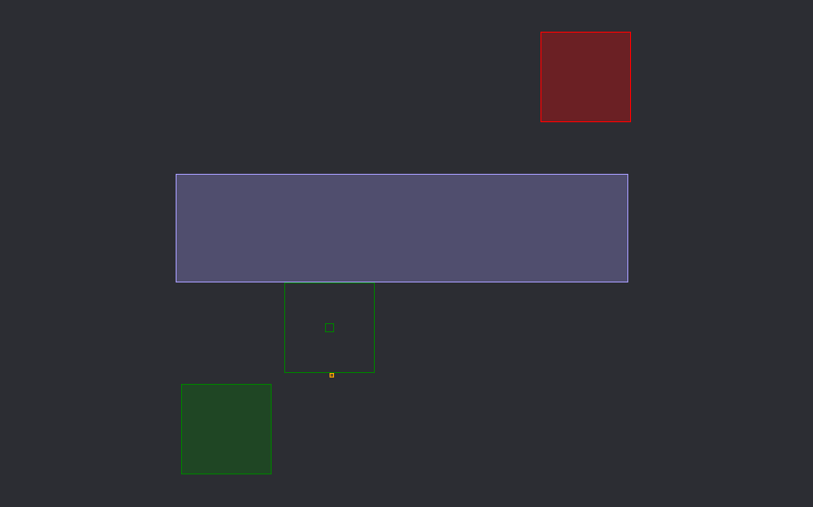
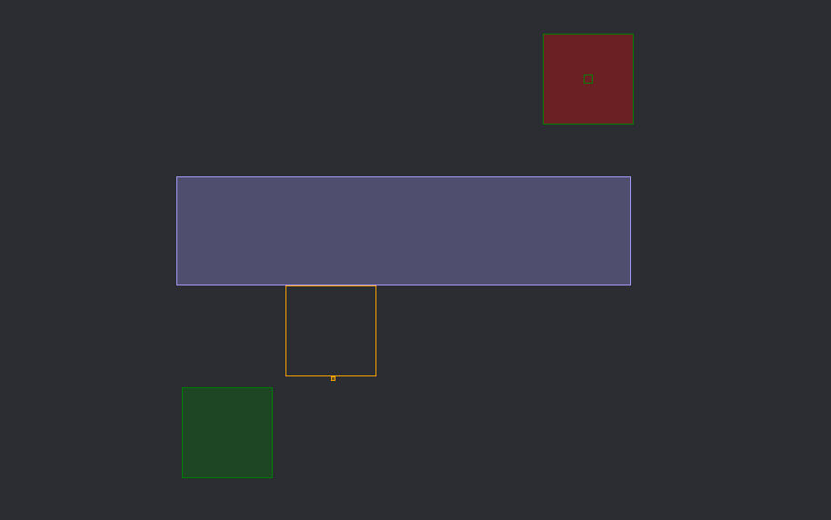
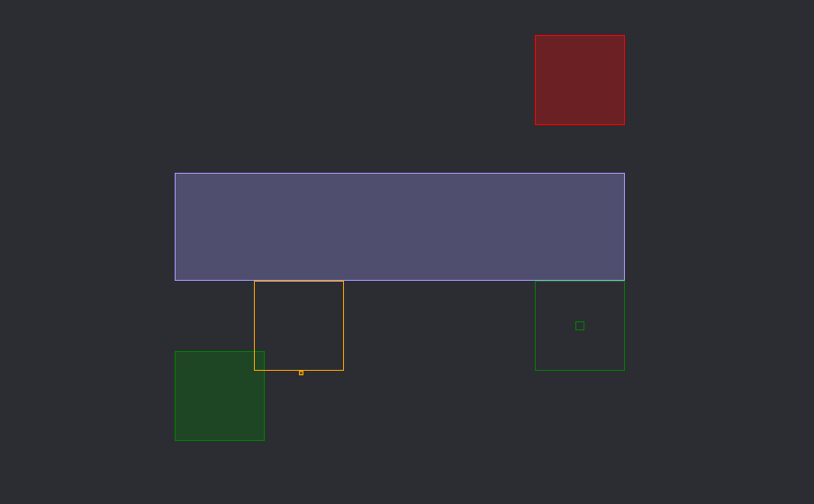
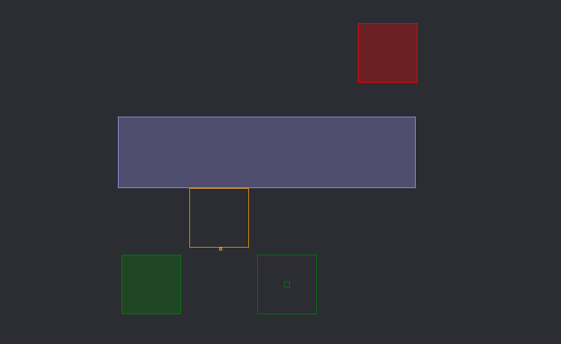
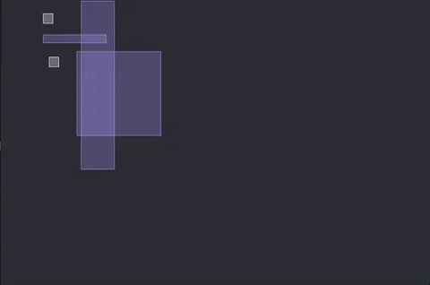

# Humper

Collision detection only for **Axis-Aligned-Bounding-Boxes** (*aka AABB*).

This library isn't a fully featured physics engine : don't expect a realistic physics simulation but it could be enough for basic game physics (platformer games, top-down games, shoot-em-ups). Though, Humper has spatial hashing for better performances and all the necessary moving and collision test tools needed for building a 2D game.

The library doesn't rely on any particular framework, its pure C# with all needed types included. It is fairly easy to integrate with existing frameworks like [Monogame](http://www.monogame.net/).

## Install

Available on NuGet

[](https://www.nuget.org/packages/Humper/)

## Quickstart



```csharp
var world = new World(500, 300);

// Create a box of size (20,20) at position (100,100)
var body = world.Create(100, 100, 20, 20);

// Create a second box
world.Create(50, 150, 100, 100);

// Try to move the box to (100,200) with a slide movement for every other collided body of the world
var result = body.Move(170,200, (collision) => CollisionResponses.Slide);

// React to collisions
if(result.HasCollided)
{
	Debug.WriteLine("Body collided!");
}
```

## Basic APIs

### IWorld

The world is a virtual representation of your physics environnement. It manages all bodies and have a given size.

The world is subdivided in cells of `64` by default to faster collision calculation, but you can also change this parameter at instanciation.

#### `IBox Create(float x, float y, float width, float height)`

Create a new box in the world.

#### `bool Remove(IBox box)`

Remove the specified box from the world.

#### `IBox Find(float x, float y, float width, float height)`

Find the boxes contained in the given area of the world.

#### `IHit Hit(Vector2 point, IEnumerable<IBox> ignoring = null)`

Queries the world to find the nearest colliding point from a given position.

#### `IHit Hit(Vector2 origin, Vector2 destination, IEnumerable<IBox> ignoring = null)`

Queries the world to find the nearest colliding position from an oriented segment.

#### `IHit Hit(RectangleF origin, RectangleF destination, IEnumerable<IBox> ignoring = null)`

Queries the world to find the nearest colliding position from a moving rectangle.
 
### IBox

A box represents any object of your physical world as an Axis-Aligned-Bounding-Boxes (*a rectangle that cannot be rotated*).

#### `float X { get; }`

The top left corner X coordinate of the box.

#### `float Y { get; }`

The top left corner Y coordinate of the box.

#### `float Height { get; }`

The height of the box.

#### `float Width { get; }`

The width of the box.

#### `IMovement Move(float x, float y, Func<ICollision, CollisionResponses> filter)`

Triggers a movement of the box in the physical world from its current position to the given one. The filters should indicate how the box reacts when colliding with another box of the world (see `Responses` section for more info).

#### `IMovement Simulate(float x, float y, Func<ICollision, ICollisionResponse> filter)`

Simulates the move of the box to the specified coordinates with collisition simulation (the boxe's position isn't altered at all).

#### `IBox AddTags(params Enum[] newTags)`

Add enumeration flags to the box.

#### `bool HasTag(params Enum[] values)`

Indicates whether the box has at least one of the given tags.

#### `bool HasTags(params Enum[] values)`

Indicates whether the box has all of the given tags.

#### `object Data { get; set; }`

Custom user data that can be attached to the box.

### ICollision

A collision represents the result of a movement query that resulted in a collision and that need to be resolved to a response.

#### `IBox Box { get; }`

The box that moved.

#### `IBox Other { get; }`

The other box than being collided by the moving box.

#### `RectangleF Origin { get; }`

The starting position of the moving box.

#### `RectangleF Goal { get; }`

The intialy requested goal destination for the moving box.

#### `Hit Hit { get; }`

Gets information about the impact point.

### IHit

An hit point represents the impact with a box of the world.

#### `IBox Box { get; }`
		
Gets the collided box.

#### `Vector2 Normal { get; set; }`

The normal vector of the collided box side.

#### `float Amount { get; set; }`

The amount of movement needed from origin to get the impact position.

#### `RectangleF Position { get; set; }`

The impact position.

#### `float Remaining { get; }`

The amount of movement needed from impact position to get the requested initial goal position.

### Responses

When moving a box, a response should be returned through a filter to indicate how this box should react to a collision with another box.

Several `CollisionResponses` are included :

#### `None`



All collisions are ignored.

#### `Touch`



The box moves to the collision impact position.

#### `Cross`



The box moves through and ignore collision.

#### `Slide`



The box slides on the collided side of the other box.

#### `Bounce`



The box is reflected from the side of the other box.

#### `Custom`

A custom implementation of `ICollisionResponse` can also be provided if needed.

### Debug layer

A debug layer is provided if you want to draw the boxes : you only have to provide basic drawing functions to the world `DrawDebug` method.

An example [Monogame](http://www.monogame.net/) implementation : 

```csharp
private void DrawCell(int x, int y, int w, int h, float alpha)
{
	spriteBatch.Draw(pixelTexture, pixelTexture.Bounds, new Rectangle(x,y,w,h), new Color(Color.White,alpha));
}

private void DrawBox(IBox box)
{
	spriteBatch.Draw(pixelTexture, pixelTexture.Bounds, box.Bounds.ToRectangle(), Color.Green);
}

private void DrawString(string message, int x, int y, float alpha)
{
	var size = this.font.MeasureString(message);
	spriteBatch.DrawString(this.font, message, new Vector2( x - size.X / 2, y - size.Y / 2), new Color(Color.White, alpha));
}
```

```csharp
protected override void Draw(GameTime gameTime)
{
	graphics.GraphicsDevice.Clear(Color.Black);
	spriteBatch.Begin(blendState: BlendState.NonPremultiplied);
	var b = world.Bounds;
	world.DrawDebug((int)b.X, (int)b.Y, (int)b.Width, (int)b.Height, DrawCell, DrawBox, DrawString);
	spriteBatch.End();
	base.Draw(gameTime);
}
```

## Samples



Check the samples if you wish to implement a :

* `Top-down`
* `Platformer`

## Ideas / Roadmap

* Add resizing
* Improve documentation
* Optimize code

## Thanks

* [gamedev.net-SweptAABB](http://www.gamedev.net/page/resources/_/technical/game-programming/swept-aabb-collision-detection-and-response-r3084)
* [bump.lua](https://github.com/kikito/bump.lua)

## Contributions

Contributions are welcome! If you find a bug please report it and if you want a feature please report it.

If you want to contribute code please file an issue and create a branch off of the current dev branch and file a pull request.

### License

MIT © [Aloïs Deniel](http://aloisdeniel.github.io)